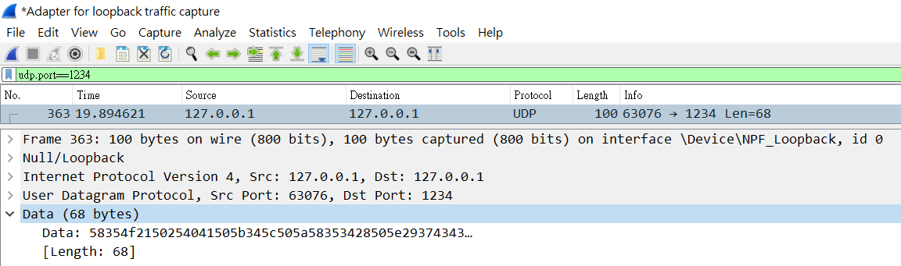

# EICAR-UDP-Sender

[EICAR](http://2016.eicar.org/86-0-Intended-use.html) UDP Sender based on Python 3 (Tested on Python 3.8.0)

## Features:

- Based Python 3
- Use the Python standard libraries only 

## Command Line Interface:


  ```powershell
  PS C:\Users\Clark\Desktop> python.exe .\EICAR-UDP-Sender.py -h
  usage: EICAR-UDP-Sender [-h] -ip IP -port PORT
  
  EICAR UDP Sender
  
  optional arguments:
    -h, --help  show this help message and exit
    -ip IP      IP address
    -port PORT  Port number
  ```

  ## Screenshots

```powershell
 PS C:\Users\Clark\Desktop> python.exe .\EICAR-UDP-Sender.py -ip 127.0.0.1 -port 1234
```



